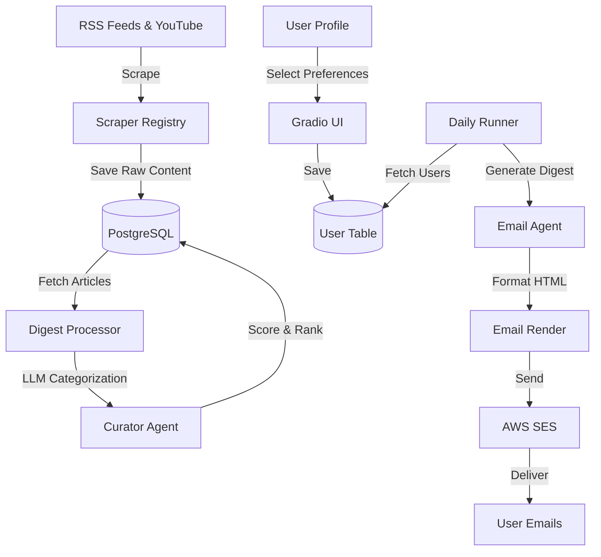

# AI Frontier

An intelligent news aggregation system that scrapes AI-related content from multiple sources, categorizes it using LLM, and delivers personalized daily email digests based on user preferences.

## What It Does

**AI Frontier** aggregates AI news and content from multiple sources:

- **RSS Feeds**: OpenAI, Anthropic, Cursor, Windsurf, DeepMind, XAI, NVIDIA
- **YouTube Channels**: Configurable channels (default: AI-focused creators)

The system processes this content through the following pipeline:

1. **Scrapes** articles and videos from configured sources
2. **Categorizes** content into 9 categories (technique, research, education, announcement, analysis, tutorial, opinion, news, others)
3. **Scores** relevance to each user's profile (background, preferences, expertise level)
4. **Generates** personalized email digests with top-ranked articles
5. **Delivers** daily summaries via AWS SES

### Content Categories

Content is automatically classified into:
- **Technique**: New methods, algorithms, or technical approaches
- **Research**: Research papers, academic work, or scientific findings
- **Education**: Educational content, tutorials, or learning materials
- **Announcement**: Product launches, company news, or official announcements
- **Analysis**: Deep dives, detailed analysis, or investigative pieces
- **Tutorial**: How-to guides, step-by-step instructions, or walkthroughs
- **Opinion**: Opinion pieces, editorials, or personal perspectives
- **News**: General news updates or current events
- **Others**: Content that doesn't fit into the above categories

Users can select their preferred categories and set preferences (e.g., prefer practical applications, avoid marketing hype) through the Gradio UI.

## Architecture



### Pipeline Flow

1. **Scraping** (`app/runner.py`)
   - Runs all registered scrapers (RSS feeds + YouTube)
   - Fetches articles/videos from last 24 hours
   - Saves raw content to database

2. **Digest Generation** (`app/services/process_digest.py`)
   - Processes raw articles/videos
   - Uses LLM to generate summaries
   - Categorizes content into 9 categories
   - Scores relevance to user profiles

3. **Email Generation** (`app/services/process_email.py`)
   - Selects top N articles by relevance score
   - Generates personalized introduction
   - Formats content as HTML email

4. **Delivery** (`app/services/ses_email.py` + `app/email/render.py`)
   - Renders HTML email with styling
   - Sends via AWS SES
   - Tracks sent digests to prevent duplicates

### Daily Pipeline

The `run_daily_pipeline()` function orchestrates:
- Scrapes all sources
- Creates digests with relevance scores
- Generates and sends personalized email digests

## Project Structure

```
app/
├── agent/              # LLM agents
│   ├── base.py        # Base agent class
│   ├── curator_digest_agent.py   # Content categorization & ranking
│   └── email_agent.py            # Email content generation
├── database/          # Database layer
│   ├── models.py      # SQLAlchemy models
│   ├── connection.py  # DB connection
│   └── *_repository.py # Data access layer
├── email/             # Email rendering
│   └── render.py      # HTML/CSS formatting
├── profiles/          # User profile configuration
│   └── user_profile.py
├── scrapers/          # Content scrapers
│   ├── base.py        # Base RSS scraper
│   ├── openai.py      # OpenAI RSS
│   ├── anthropic.py   # Anthropic RSS
│   ├── cursor.py      # Cursor RSS
│   ├── windsurf.py    # Windsurf RSS
│   ├── deepmind.py    # DeepMind RSS
│   ├── xai.py         # XAI RSS
│   ├── nvdia.py       # NVIDIA RSS
│   └── youtube.py     # YouTube channel scraper
├── services/          # Processing services
│   ├── process_digest.py  # Digest generation
│   ├── process_email.py   # Email orchestration
│   └── ses_email.py       # AWS SES client
├── ui/                 # User interface
│   └── profile_ui.py   # Gradio UI for user profiles
├── daily_runner.py    # Main pipeline orchestrator
└── runner.py          # Scraper registry & execution
```

## Quick Start

### Prerequisites

- Python 3.11+
- Docker & Docker Compose (for local database)
- Google Gemini API key ([Get one here](https://makersuite.google.com/app/apikey))
- AWS SES configured (for email sending)

### Setup

1. **Clone and install dependencies:**
   ```bash
   git clone <repo-url>
   cd ai-frontier
   uv sync
   ```

2. **Start PostgreSQL with Docker Compose:**
   ```bash
   docker-compose up -d
   ```

3. **Configure environment variables:**
   ```bash
   cp app/example.env .env
   # Edit .env and add:
   # - GEMINI_API_KEY
   # - AWS_REGION, SES_FROM_EMAIL, AWS_ACCESS_KEY_ID, AWS_SECRET_ACCESS_KEY
   # - YOUTUBE_API_KEY (optional, for YouTube scraping)
   ```

4. **Initialize database tables:**
   ```bash
   uv run python -c "from app.database.connection import create_all_tables; create_all_tables()"
   ```

5. **Create user profile (via Gradio UI):**
   ```bash
   uv run python -m ui.profile_ui
   ```
   Open the URL shown and configure your preferences.

6. **Run the pipeline:**
   ```bash
   uv run python -m app.daily_runner
   ```

### Running Individual Steps

```bash
# Scrape content
uv run python -m app.runner

# Generate digests
uv run python -m app.services.process_digest

# Send email digest
uv run python -m app.services.process_email
```

## Deployment

See `deployment/` folder for cloud deployment guides:
- **AWS**: ECS Fargate + EventBridge + RDS
- **Google Cloud**: Cloud Run + Cloud SQL
- **General Cloud**: Step-by-step guide

## Technology Stack

- **Python 3.11+**: Core language
- **PostgreSQL**: Database
- **SQLAlchemy**: ORM
- **Google Gemini API**: LLM processing
- **AWS SES**: Email delivery
- **Gradio**: User interface
- **UV**: Package management

## License

MIT
